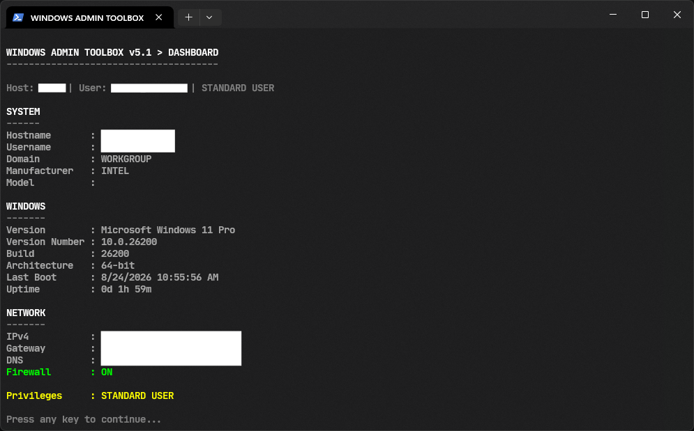
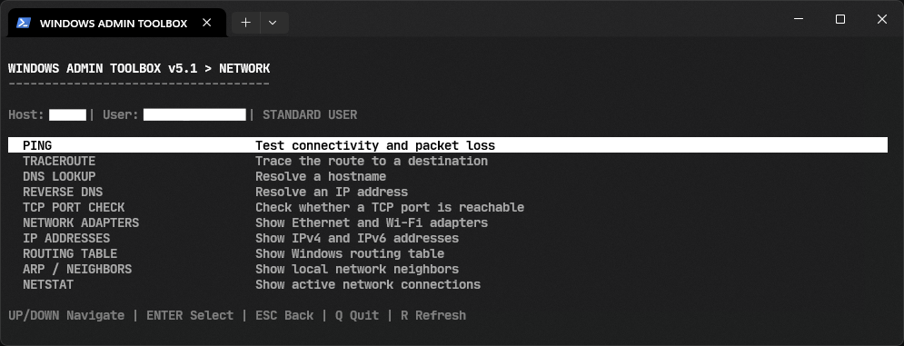
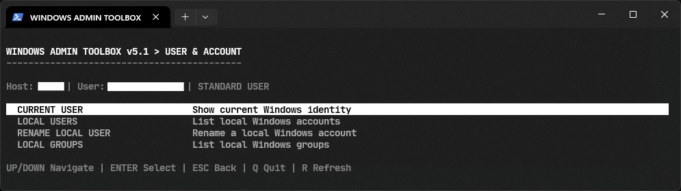

# Windows Admin Toolkit

A PowerShell-based Terminal User Interface (TUI) for common Windows administration, diagnostics, networking, system information, user management, and repair tasks.


## Features

### Dashboard

Displays:

<table>
  <tr>
    <th>System Information</th>
    <th>System Information</th>
    <th>System Information</th>
  </tr>
  <tr>
    <td>Hostname</td>
    <td>Current username</td>
    <td>Domain</td>
  </tr>
  <tr>
    <td>Computer manufacturer and model</td>
    <td>Windows version and build</td>
    <td>Architecture</td>
  </tr>
  <tr>
    <td>Last boot time</td>
    <td>System uptime</td>
    <td>IPv4 address</td>
  </tr>
  <tr>
    <td>Default gateway</td>
    <td>DNS servers</td>
    <td>Firewall status</td>
  </tr>
  <tr>
    <td colspan="3" align="center">Current privilege level</td>
  </tr>
</table>



### Network

Provides tools for:

<table>
  <tr>
    <th>Network Diagnostics</th>
    <th>Network Diagnostics</th>
    <th>Network Diagnostics</th>
  </tr>
  <tr>
    <td>Ping and packet-loss testing</td>
    <td>Traceroute</td>
    <td>DNS lookup</td>
  </tr>
  <tr>
    <td>Reverse DNS lookup</td>
    <td>TCP port testing</td>
    <td>Network adapter information</td>
  </tr>
  <tr>
    <td>IPv4 and IPv6 addresses</td>
    <td>Routing table inspection</td>
    <td>ARP and network neighbor information</td>
  </tr>
  <tr>
    <td colspan="3" align="center">TCP and UDP connection inspection through Netstat</td>
  </tr>
</table>



The Netstat interface also supports filtering connections by port and refreshing results.


### Disk and Storage

Provides:

<table>
  <tr>
    <th>System Health & Storage</th>
    <th>System Health & Storage</th>
    <th>System Health & Storage</th>
  </tr>
  <tr>
    <td>Disk usage information</td>
    <td>Volume and filesystem information</td>
    <td>CHKDSK <code>/SCAN</code></td>
  </tr>
  <tr>
    <td>SFC <code>/SCANNOW</code></td>
    <td>DISM <code>CheckHealth</code></td>
    <td>DISM <code>ScanHealth</code></td>
  </tr>
  <tr>
    <td colspan="3" align="center">DISM <code>RestoreHealth</code></td>
  </tr>
</table>


Administrative privileges are required for CHKDSK, SFC, and DISM operations.

### Windows and Updates

Provides:

<table>
  <tr>
    <th>Windows & Updates</th>
    <th>Windows & Updates</th>
    <th>Windows & Updates</th>
  </tr>
  <tr>
    <td>Windows version and build information</td>
    <td>Installed Windows hotfixes</td>
    <td><code>GPUPDATE /FORCE</code></td>
  </tr>
  <tr>
    <td>Windows Update scan</td>
    <td>Windows Update settings shortcut</td>
    <td>Windows component cleanup</td>
  </tr>
</table>


### System

Provides:

<table>
  <tr>
    <th>System Diagnostics</th>
    <th>System Diagnostics</th>
    <th>System Diagnostics</th>
  </tr>
  <tr>
    <td>Computer and BIOS information</td>
    <td>RAM information</td>
    <td>Running processes</td>
  </tr>
  <tr>
    <td>Windows services</td>
    <td>Environment variables</td>
    <td>Recent System event log errors</td>
  </tr>
</table>


### User and Account

Provides:

<table>
  <tr>
    <th>Windows User & Group Management</th>
    <th>Windows User & Group Management</th>
    <th>Windows User & Group Management</th>
  </tr>
  <tr>
    <td>Current Windows identity</td>
    <td>Local user enumeration</td>
    <td>Local group enumeration</td>
  </tr>
  <tr>
    <td colspan="3" align="center">Local user renaming</td>
  </tr>
</table>



Renaming a local user requires administrator privileges.

### Repair and Maintenance

Provides common network repair operations:

<table>
  <tr>
    <th>Network Reset & Recovery</th>
    <th>Network Reset & Recovery</th>
    <th>Network Reset & Recovery</th>
  </tr>
  <tr>
    <td>Flush DNS cache</td>
    <td>Renew DHCP lease</td>
    <td>Reset Winsock</td>
  </tr>
  <tr>
    <td>Reset TCP/IP</td>
    <td colspan="2" align="center">Network reset recommendations</td>
  </tr>
</table>


Operations that can affect network connectivity require confirmation before execution.

### Diagnostics

Generates:

<table>
  <tr>
    <th>Reports</th>
    <th>Reports</th>
    <th>Reports</th>
  </tr>
  <tr>
    <td colspan="3" align="center">Network reports</td>
  </tr>
  <tr>
    <td colspan="3" align="center">System reports</td>
  </tr>
</table>


Network reports are saved to the current user's Desktop as:

```text
NetworkReport_YYYYMMDD_HHMMSS.txt
```

System reports are saved as:

```text
SystemReport_YYYYMMDD_HHMMSS.txt
```

## Controls

| Key       | Action         |
| --------- | -------------- |
| Up / Down | Navigate menus |
| Enter     | Select         |
| Esc       | Go back        |
| Q         | Quit           |
| R         | Refresh        |
| Backspace | Delete input   |

## Installation

Clone or download the project and place the PowerShell script in a convenient directory.

Example:

```powershell
git clone https://github.com/pipeline-voyager/Windows-Administration-Tools.git

cd Windows_Admin_Tools/
```

No additional PowerShell modules or external dependencies are required beyond the Windows components used by the toolbox.

## Running

Open PowerShell and execute:

```powershell
.\Windows_Admin_Toolbox_v1.ps1
```

For full functionality, start PowerShell as Administrator before running the script.

If PowerShell's execution policy prevents the script from running, review the current policy with:

```powershell
Get-ExecutionPolicy
```

Do not change the execution policy globally unless it is appropriate for your environment.

## Administrator Privileges

The toolbox can run as a standard user, but several operations require an elevated PowerShell session.

Administrator privileges are required for operations such as:

<table>
  <tr>
    <th>System Repair & Recovery</th>
    <th>System Repair & Recovery</th>
    <th>System Repair & Recovery</th>
  </tr>
  <tr>
    <td>CHKDSK</td>
    <td>SFC</td>
    <td>DISM</td>
  </tr>
  <tr>
    <td>Windows Update scanning</td>
    <td>Component cleanup</td>
    <td>Local user management</td>
  </tr>
  <tr>
    <td>DNS flushing</td>
    <td>DHCP renewal</td>
    <td>Winsock reset</td>
  </tr>
  <tr>
    <td colspan="3" align="center">TCP/IP reset</td>
  </tr>
</table>

The application detects whether it is running with administrator privileges and displays the current privilege level in the interface.

## Safety

This tool executes Windows administrative commands and system configuration operations.

Review an operation before executing it, especially:

<table>
  <tr>
    <th>System Repair & Recovery</th>
    <th>System Repair & Recovery</th>
    <th>System Repair & Recovery</th>
  </tr>
  <tr>
    <td>SFC</td>
    <td>DISM RestoreHealth</td>
    <td>CHKDSK</td>
  </tr>
  <tr>
    <td>User account changes</td>
    <td>Winsock reset</td>
    <td>TCP/IP reset</td>
  </tr>
  <tr>
    <td>DHCP renewal</td>
    <td colspan="2" align="center">Component cleanup</td>
  </tr>
</table>

Some operations can temporarily interrupt network connectivity or modify system configuration.

The toolbox does not automatically perform a complete Windows network reset because doing so can remove or modify network adapter configuration.

## Author

Carl Lazaro

`@pipeline-voyager`

## Version

Version 5.1
